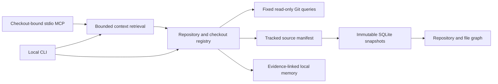

# Architecture

Grove owns its storage and runtime. Graft is a reference, not an installed dependency.

## Identity

A normalized origin maps independent clones to one repository record. Each path has
its own checkout record and latest snapshot pointer. Hosted remote credentials and
query strings are not persisted. GitHub paths are normalized case-insensitively;
other forge paths preserve case. SSH host aliases and non-default ports are not
automatically equated. Repositories without origin use their common Git directory;
independent clones without remotes need a future explicit alias workflow.

Changed origin is a blocking identity transition until explicit `register --fork`.
No forge API is used. Repository aliases are identity hints in a single-user
prototype, not an authorization boundary. Organization policy is future work.

## Snapshots and concurrency

Snapshot IDs hash the repository ID, engine version, HEAD and sorted working-tree
manifest (including exclusions). Lineage labels do not decide code state.
File hashes describe current working-tree bytes for tracked files, including local
edits. Staged content is not captured as a separate version. The index never loads source
objects from Git and never invokes object transports. Two hashing passes and Git
metadata checks reject changes observed during indexing. Source is not retained.

A transaction inserts a complete snapshot and switches the checkout pointer.
An existing identical snapshot is reused. SQLite serializes writers with a busy
timeout; readers can retain the last complete view through WAL. A dedicated job
coordinator and large-repository incremental artifact store are later work.

The 0.3 graph includes file and parser-derived function, class, method and import
nodes for TypeScript, JavaScript and Python. Relative imports connect when one
indexed path resolves. Unresolved imports are explicitly labeled. Call edges are
not inferred. Parsed facts are cached by content hash, language and parser version.

## Memory

Memory belongs to a repository, not to a path. It is candidate or explicitly reviewed.
Optional evidence consists of an indexed source path and its content hash.
Retrieval reindexes the target checkout and compares evidence. `matching` means
matching file bytes, not verified meaning; dependency-sensitive freshness is future work.
No automatic model-generated memory or automatic promotion is present.

## Checkout lifecycle

`status` actively probes each stored path. Missing is separate from inaccessible and
from explicit deletion. `mark-deleted --confirm` records an event after absence is
observed. Reappearance can reactivate a checkout. Remote/common-directory mismatch
is identity-changed. Merge conflicts are reported from Git's unmerged index entries;
Grove will not index that checkout until Git records them as resolved.

Historical file snapshots remain queryable in the database, but are never labeled
current through `graph` when the checkout is missing, conflicted, or inaccessible.

## Offline contract

Runtime dependencies are Node built-ins and local Git. There is no socket listener,
HTTP client, updater, telemetry, package download, or LLM integration. Development
publishing to GitHub is external to Grove. A strict organization rollout must also
deny egress at the operating-system boundary and audit the child-process environment.

## Bounded context retrieval

The 0.3 context builder refreshes one checkout snapshot, ranks file paths,
parsed names and reviewed memory by query-word matches, and checks evidence against
that snapshot. Optional source search scans current bytes without returning bodies.
It excludes stale/candidate memories and returns whole items under a compact JSON
byte limit. Snapshot IDs and omitted-result counts expose freshness and coverage.
The stdio MCP process fixes its checkout at startup; no tool can rebind it or write
memories. Snapshot refresh still writes cache metadata and events. See [MCP](MCP.md).

## Policy and backup

A store-owned `policy.json` restricts indexed extensions, file size/count and
path prefixes; its hash contributes to snapshot identity. `VACUUM INTO` creates
a consistent SQLite backup. Restore validates integrity/schema into a new home.
Source files are not backed up by Grove.
